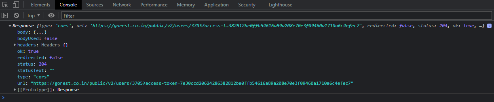

# Frontend-test
Prova prática front-end

### Métodos de requisições HTTP utilizados no projeto

| Método                             | Semântica                |
| -------------                      |:-------------:           |
| GET                                | Obtém uma lista de dados |       
| POST                               | Cria um novo recurso     |
| PUT                                | Atualiza um recurso      |
| Delete                             | Remove um recurso        |

### POST

### PUT

### DELETE

---

### Tecnologias e ferramentas utilizadas

- JavaScript
- Vscode v1.71
- API: https://gorest.co.in/public/v2/users
- Documentação: https://gorest.co.in
